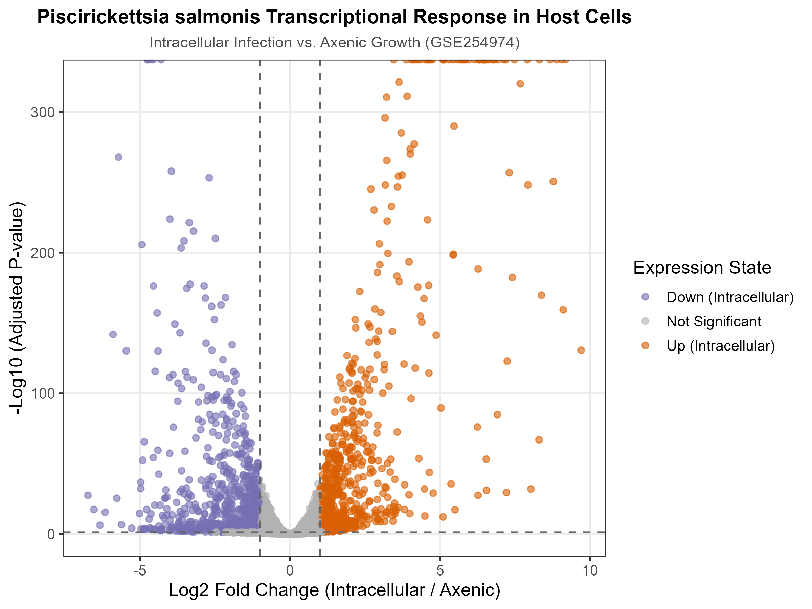
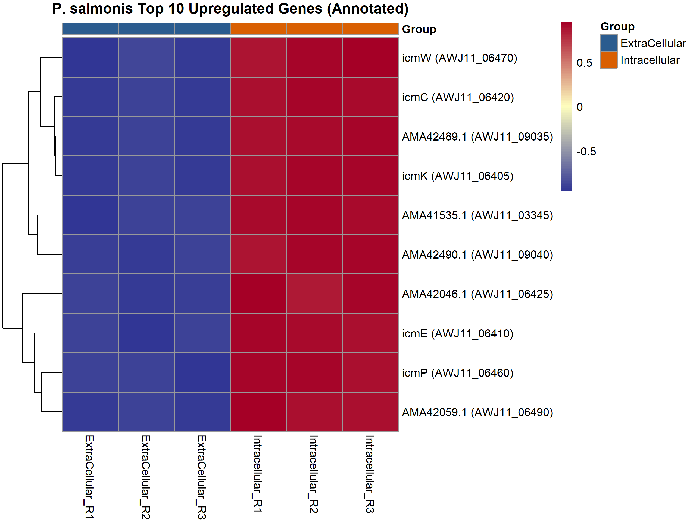
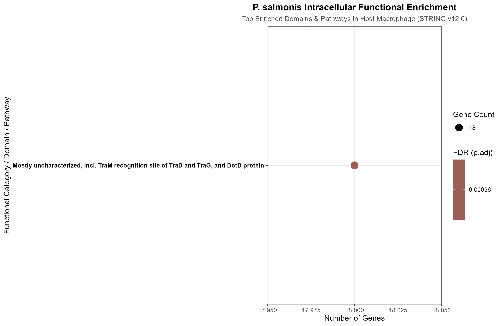
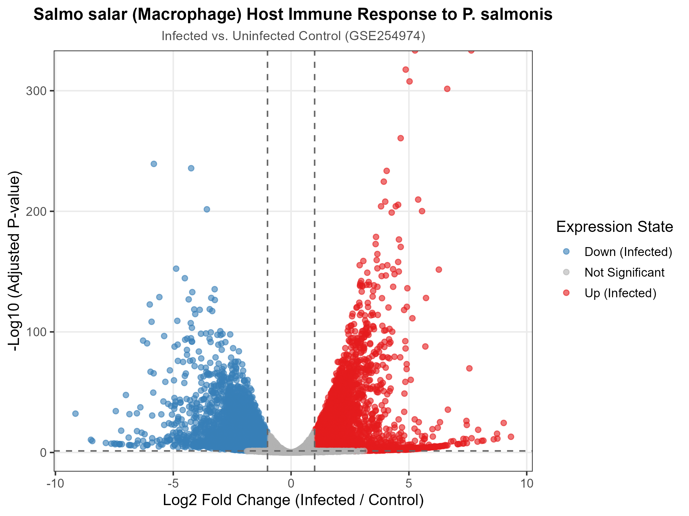
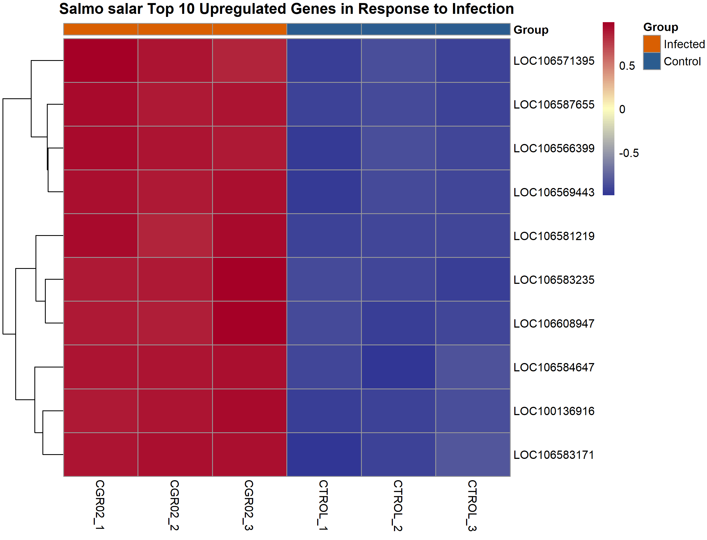
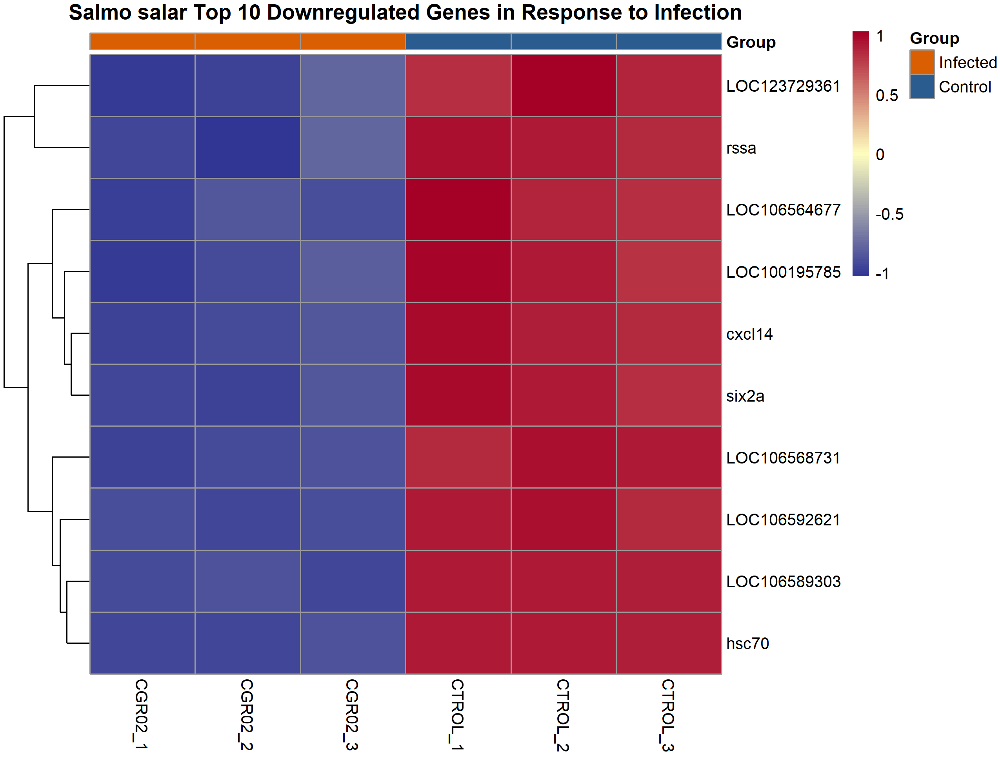
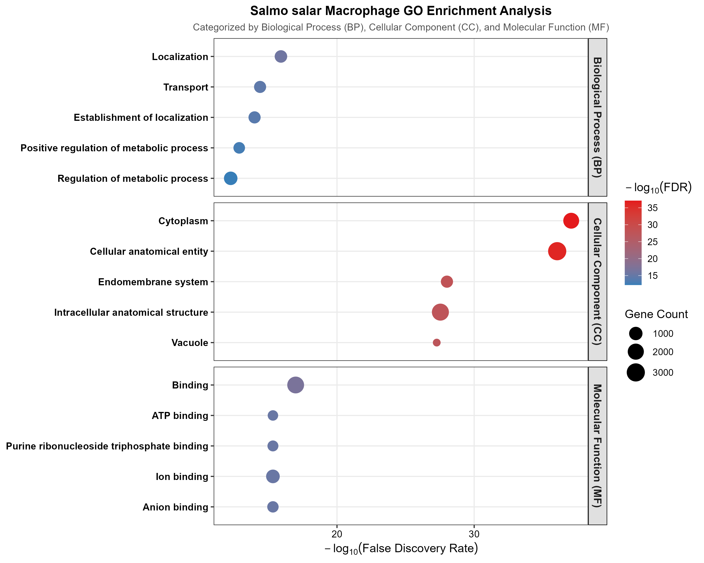
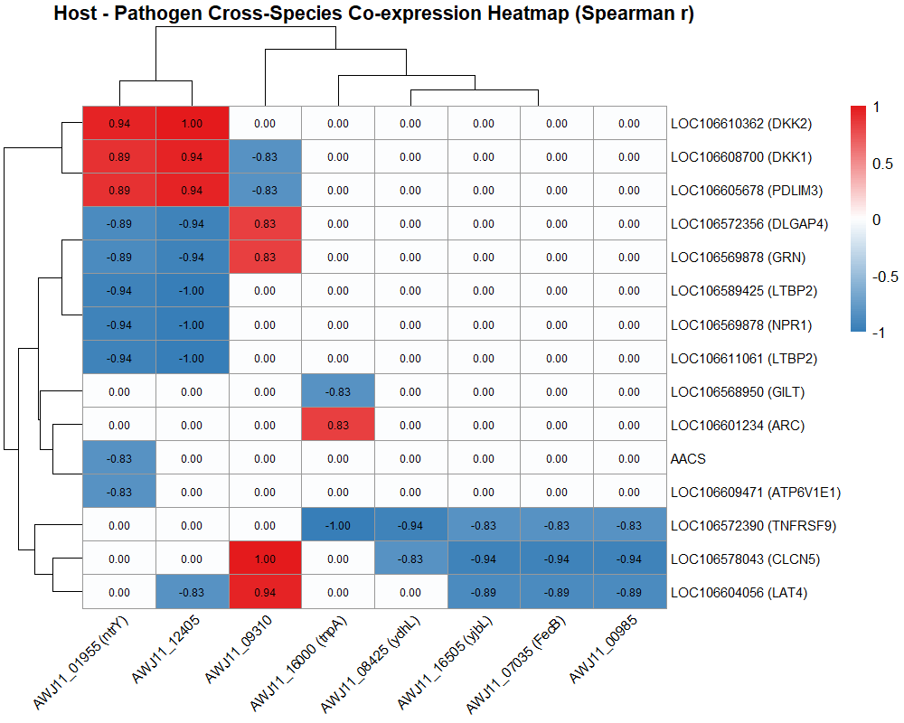

# *P. salmonis* & Host Dual RNA-seq & Cross-Species Co-expression Analysis

> **Note**: For Chinese version of this documentation, please see [README_CN.md](README_CN.md).


## Project Overview

Based on public Dual RNA-seq datasets from the publication *"Dual transcriptional analysis provides insights into the replicative niche of P. salmonis and the host response during infection"*, this project conducts a systematic practice on **Dual RNA-seq expression profiling and cross-species co-expression network analysis**. The study model utilizes the interaction between Atlantic salmon (*Salmo salar*, SHK-1 macrophage-like cell line) and the intracellular pathogen *Piscirickettsia salmonis*.

By simultaneously dissecting the dynamic transcriptomic changes of both host and pathogen during infection, combined with Spearman correlation analysis and cross-species co-expression heatmaps, this project deeply reconstructs the bacterial adaptation mechanisms within the host's **acidified vacuole niche** as well as the host defense responses.


## Core Biological Discoveries

1. **Host Lysosome & Acidification Response**:
   - Host cells significantly activated pathways related to **lysosomal biogenesis** and **proteolytic activity**.
   - Cross-species co-expression analysis demonstrated significant co-regulation among **`ATP6V1E1` (LOC106609471)** (a core proton pump subunit driving vacuolar acidification), **`CLCN5` (LOC106578043)** (an endosomal/lysosomal ion channel), and **`GILT` (LOC106568950)** (a lysosomal thiol reductase), confirming that the bacteria reside inside an acidified late endosomal/lysosomal-like compartment.
2. **Bacterial Intracellular Adaptation**:
   - In alignment with the host microenvironment, *P. salmonis* markedly upregulated the **Dot/Icm Type IVB secretion system (T4SS)**, **stress-response pathways** (e.g., sensor kinase **`ntrY` / AWJ11_01955**), and **iron-acquisition systems**.
3. **Host-Pathogen Cross-Species Interaction & Metabolic Conflict**:
   - The key bacterial iron-uptake gene **`FedB` (AWJ11_07035)** exhibited a strong negative correlation ($r \le -0.83$) with the host immune receptor **`TNFRSF9`** and the amino acid/ion transporter **`LAT4`**. This validates the molecular hypothesis at the transcriptomic level that **"host iron availability directly modulates intracellular bacterial growth"** alongside cross-species metabolic competition.


| **Analysis Module**                     | **Result Preview**                                           | **Description**                                              |
| --------------------------------------- | ------------------------------------------------------------ | ------------------------------------------------------------ |
| **Pathogen DEG Screening**              |          | Volcano plot showing differentially expressed genes of *P. salmonis* under intracellular vs. axenic growth conditions. |
| **Pathogen Top 10 Upregulated Genes**   |      | Heatmap displaying Top 10 key bacterial genes specifically activated intracellularly (including Dot/Icm T4SS components). |
| **Pathogen Functional Enrichment**      |            | Dotplot revealing significant enrichment of upregulated bacterial genes in environmental stress, iron uptake, and virulence domains. |
| **Host Immune Response Volcano Plot**   |          | Volcano plot illustrating global transcriptomic reprogramming of Atlantic salmon (SHK-1) post-infection. |
| **Host Top 10 Upregulated Genes**       |      | Heatmap showing Top 10 host immune and cellular stress response genes significantly upregulated in infected groups. |
| **Host Top 10 Downregulated Genes**     |    | Heatmap of Top 10 host genes significantly suppressed or shut down during infection. |
| **Host Multidimensional GO Enrichment** |      | Categorized GO enrichment across BP (Biological Process), CC (Cellular Component / Lysosome & Vesicle), and MF (Molecular Function). |
| **Cross-Species Co-expression Heatmap** |  | **Core Result**: Spearman correlation heatmap capturing cross-species co-regulatory networks between host vacuolar acidification/lysosomal genes (e.g., `ATP6V1E1`) and bacterial virulence/iron uptake genes (e.g., `FedB`, `ntrY`). |


# Directory Structure


```
📁 BioPratice09_Dual_RNA/
├── 📁 plots/
│   ├── 📄 bact_GO_dotplot.png (0.11 MB)
│   ├── 📄 bact_top10_up_heatmap.png (<0.1 MB)
│   ├── 📄 bact_volcano_plot.png (0.50 MB)
│   ├── 📄 host_GO_split_dotplot.png (0.23 MB)
│   ├── 📄 Host_Pathogen_Coexpression_Heatmap.png (<0.1 MB)
│   ├── 📄 host_top10_down_heatmap.png (<0.1 MB)
│   ├── 📄 host_top10_up_heatmap.png (<0.1 MB)
│   └── 📄 host_volcano_plot.png (0.53 MB)
├── 📁 raw_data/
│   ├── 📄 GSE254974_CGR02_counts_extra-intracellular.txt.gz (<0.1 MB)
│   └── 📄 GSE254974_SHK_counts_infected-control.txt.gz (0.52 MB)
├── 📁 results/
│   ├── 📁 enrichment/
│   │   ├── 📄 bact_up_GO_enrichment.csv (<0.1 MB)
│   │   ├── 📄 host_up_gene_list.txt (<0.1 MB)
│   │   └── 📄 host_up_STRING_enrichment.csv (6.43 MB)
│   ├── 📄 bact_DEG_results.csv (0.34 MB)
│   ├── 📄 cross_species_network_edges.csv (<0.1 MB)
│   ├── 📄 heatmap_bact_genes_annotated.csv (<0.1 MB)
│   ├── 📄 heatmap_host_genes_annotated.csv (<0.1 MB)
│   ├── 📄 heatmap_host_genes_ortholog_annotated.csv (<0.1 MB)
│   ├── 📄 host_DEG_results.csv (3.41 MB)
│   ├── 📄 master_host_annotation.csv (6.25 MB)
│   ├── 📄 parsed_bact_15_genes_refined.csv (<0.1 MB)
│   └── 📄 parsed_host_15_genes_refined.csv (<0.1 MB)
├── 📁 script/
│   ├── 📄 00_1_data_check.R (<0.1 MB)
│   ├── 📄 01_bact_deseq2.R (<0.1 MB)
│   ├── 📄 02_bact_GO_analysis.R (<0.1 MB)
│   ├── 📄 03_host_deseq2.R (<0.1 MB)
│   ├── 📄 04_host_enrichment.R (<0.1 MB)
│   ├── 📄 05_calc_cross_species_edges.R (<0.1 MB)
│   └── 📄 06_dual_coexpression_heatmap.R (<0.1 MB)
├── 📄 BioPratice09_Dual_RNA.Rproj (<0.1 MB)
└── 📄 README_CN.md (<0.1 MB)
└── 📄 README.md (<0.1 MB)
```


## Dependencies & Quick Reproducibility


To execute the entire analysis pipeline, simply run the driver script in the RStudio console from the project root directory:

```
source("run_pipeline.R")
```


# Troubleshooting & Technical Pitfalls


### 1. Cross-Species Gene ID Standardization & Namespace Conflicts

- **Issue**: Host genes typically use NCBI Symbols or LOC IDs (e.g., `LOC106609471`), whereas bacterial genes use specific Locus Tags (e.g., `AWJ11_07035`). Merging these into a cross-species correlation matrix often causes column name conflicts or unreadable heatmap labels.
- **Troubleshooting & Solution**:
  - Implemented automated namespace prefixes (`Host_` / `Pathogen_`) in `05_calc_cross_species_edges.R`.
  - Built an independent metadata annotation table to dynamically map bacterial Locus Tags to their known gene symbols (e.g., `FedB`, `ntrY`) prior to heatmap rendering, significantly enhancing figure readability.

### 2. Label Overlapping & Dendrogram Clipping in Complex Heatmaps

- **Issue**: When plotting cross-species co-expression heatmaps with `pheatmap`, high gene density leads to text overlapping and squeezed axis labels, lacking explicit correlation values.
- **Troubleshooting & Solution**:
  - Explicitly defined fixed grid dimensions (`cellwidth` and `cellheight`) in `06_dual_coexpression_heatmap.R`.
  - Enabled `display_numbers = TRUE` to overlay rounded Spearman $r$ values onto the heatmap cells, formatted via `number_color`.
  - Customized a centered blue-white-red color gradient (centered at 0) to clearly distinguish positive vs. negative correlation strengths.

### 3. Multi-script Dependency Conflicts & Environment Reproducibility

- **Issue**: Reproducing bioinformatics workflows often fails due to missing dependencies (`DESeq2`, `clusterProfiler`, or `pheatmap`) scattered across CRAN and Bioconductor.
- **Troubleshooting & Solution**:
  - Created `install_dependencies.R` utilizing the **`pak` package manager**, enabling fast automatic dependency scanning, repository resolution (CRAN vs. Bioc), and parallel installation.
  - Developed `run_pipeline.R` integrated with `tryCatch()` exception handling and step-by-step execution timers for "one-click hands-free" reproducibility.